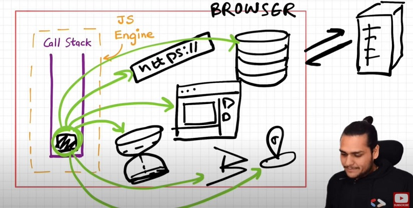
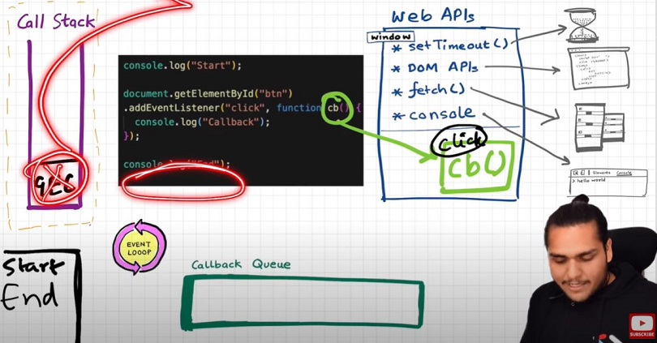
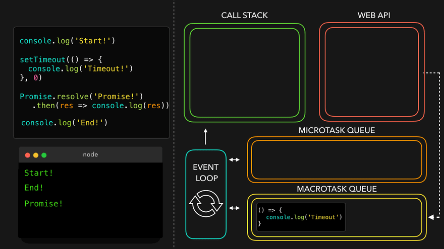

# Episode 15: Asynchronous JavaScript & EVENT LOOP from scratch

:::info Important Note
The call stack executes any execution context that enters it immediately. Time, tide, and JavaScript wait for none. In summary: The call stack operates without any built-in timer mechanism.
:::

The browser contains a JavaScript Engine with a Call Stack that manages Global Execution Context, Local Execution Context, and other execution contexts.

However, browsers provide many additional capabilities beyond the JavaScript engine - Local Storage, Timers, URL navigation, Bluetooth access, Geolocation services, and much more.

JavaScript requires a mechanism to connect the call stack with these browser capabilities. This connection is established through Web APIs.



## Web APIs

None of the following features are part of core JavaScript! These are additional capabilities that browsers provide. The browser grants the JavaScript call stack access to these powerful features.


- **setTimeout()**, **DOM APIs**, **fetch()**, **localStorage**, **console** (yes, even console.log is not part of JavaScript!), **location**, and many more.

  - **setTimeout()**: Timer functionality
  - **DOM APIs**: e.g., Document.xxxx; Used to access and manipulate the HTML DOM tree (Document Object Manipulation)
  - **fetch()**: Used to establish connections with external servers (e.g., Netflix servers)

We access all these features within the call stack through the global object, specifically **window**.

- We can use the window keyword explicitly: `window.setTimeout()`, `window.localStorage`, `window.console.log()` to output content to the console.
- Since window is the global object and all these functions exist within the global object, we typically don't write 'window' explicitly, but it's implicitly present.

Let's examine the following code example and understand its execution:


```javascript
console.log('start');
setTimeout(function cb() {
  console.log('timer');
}, 5000);
console.log('end');
// Output: start end timer
```

:::note Execution Flow
- First, a Global Execution Context (GEC) is created and placed inside the call stack.
- `console.log("start");` invokes the console Web API (through the window object), which modifies values in the console.
- `setTimeout(function cb() { console.log("timer");}, 5000);` calls the setTimeout Web API, providing access to timer functionality. It stores the callback function `cb()` and initiates the timer.
- `console.log("end");` calls the console API and logs output to the console. After this, the GEC is removed from the call stack.
- Throughout this process, the timer continues counting down. When it reaches zero, the callback `cb()` needs to execute.
- For `cb()` to execute, it must enter the call stack. This process requires the **Event Loop** and **Callback Queue**.
:::

## Event Loop and Callback Queue

**Question: How does the timer callback execute after 5 seconds?**

- The callback function `cb()` cannot directly enter the call stack for execution. When the timer expires, it first enters the callback queue.
- The Event Loop continuously monitors the callback queue, checking for elements to transfer to the call stack. It functions as a gatekeeper.
- Once `cb()` enters the callback queue, the Event Loop pushes it to the call stack for execution. The Console API is then used to print the output.


**Question: Another example to understand Event Loop & Callback Queue**

Examine the following image and code to understand the mechanism:



```javascript
console.log('Start');
document.getElementById('btn').addEventListener('click', function cb() {
  // cb() is registered in the Web API environment with the click event attached to it
  // This process is called: REGISTERING CALLBACK AND ATTACHING EVENT TO IT
  console.log('Callback');
});
console.log('End'); // calls console API and logs to console. After this, GEC is removed from call stack.

// In the above code, even after the console prints "Start" and "End" and the GEC is removed,
// the event listener remains in the Web API environment (waiting for potential user clicks)
// until explicitly removed or the browser is closed.
```

:::tip Event Loop Responsibility
The Event Loop has a single responsibility: continuously check the callback queue and transfer any found elements to the call stack while removing them from the callback queue.
:::

**Question: Why do we need a callback queue?**

**Answer**: Consider a scenario where a user clicks a button 6 times rapidly. This results in 6 `cb()` functions being placed in the callback queue. The Event Loop checks if the call stack is empty/available and whether the callback queue contains elements (6 in this case). Elements from the callback queue are removed, placed in the call stack, executed, and then removed from the call stack.

## Behavior of fetch (Microtask Queue)

Let's examine the following code and understand its behavior:

```javascript
console.log("Start"); // invokes the console Web API through the window object
setTimeout(function cbT() {
  console.log("CB Timeout");
}, 5000);
fetch("https://api.netflix.com").then(function cbF() {
    console.log("CB Netflix");
}); // takes 2 seconds to receive response
// millions of lines of code
console.log("End");
```

**Code Explanation:**
- The initial steps follow the same pattern as previous examples up to the `fetch()` call.
- The `fetch` function registers `cbF` in the Web API environment alongside the existing `cbT`.
- `cbT` waits for 5000ms before being placed in the callback queue. `cbF` waits for data from Netflix servers (approximately 2 seconds).
- During execution of millions of lines of code, both timers complete: the 5-second timer expires and the Netflix server response arrives.
- The response data from `cbF` is stored in a structure called the **Microtask Queue**.
- After timer expiration, `cbT` is ready for execution in the **Callback Queue**.
- The **Microtask Queue** functions identically to the Callback Queue but with **higher priority**. Functions in the Microtask Queue execute before those in the Callback Queue.
- Console output sequence: "Start" and "End" print first. Then `cbF` enters the call stack, printing "CB Netflix" before being removed. Finally, `cbT` is transferred from the callback queue to the call stack, prints "CB Timeout", and is removed.


Microtask Priority Visualization


### What enters the Microtask Queue?

- All callback functions originating from **promises** enter the Microtask Queue.
- **Mutation Observer**: Continuously monitors DOM tree changes and executes callback functions when mutations occur.
- Callback functions from promises and mutation observers are placed in the **Microtask Queue**.
- All other callbacks are placed in the **Callback Queue (also known as Task Queue)**.

:::warning Starvation Risk
If tasks in the Microtask Queue continuously generate new tasks, elements in the callback queue may never execute. This phenomenon is called **starvation**.
:::

## Frequently Asked Questions

**1. When does the Event Loop actually start?**
The Event Loop, as its name suggests, is a single-threaded, nearly infinite loop. It runs continuously and performs its designated function.

**2. Are only asynchronous Web API callbacks registered in the Web API environment?**
Yes. Synchronous callback functions (such as those passed to map, filter, and reduce) are not registered in the Web API environment. Only asynchronous callback functions undergo this process.

**3. Does the Web API environment store only callback functions and push the same callbacks to queues/microtask queues?**
Yes, callback functions are stored, and references are scheduled in the appropriate queues. For event listeners (such as click handlers), the original callbacks remain in the Web API environment indefinitely. This is why explicitly removing listeners when no longer needed is recommended for proper garbage collection.

**4. What happens if setTimeout delay is set to 0ms? Does the callback move to the queue immediately?**
No, setTimeout() has reliability limitations. The callback function must wait until the Call Stack is empty. Therefore, a 0ms callback might wait 100ms or longer if the stack is occupied.

## Visual Demonstration of Event Loop, Callback Queue & Microtask Queue




---

📺 **Watch Live On YouTube:**  
Click the image below to watch this episode on how Event Loop work in Javascript:

[](https://www.youtube.com/watch?v=8zKuNo4ay8E&ab_channel=AkshaySaini)
