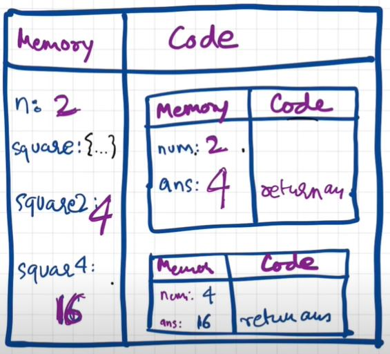
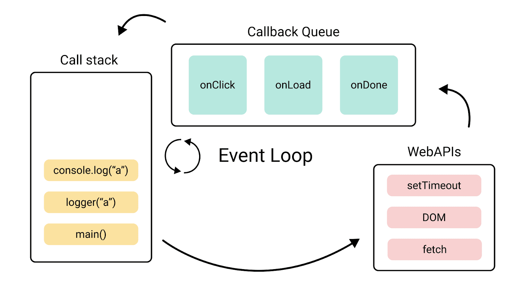

# Episode 2: How JavaScript Code is executed?

Let's dive deeper into how JavaScript runs behind the scenes.

---

## 🧠 Execution Context and Phases
- JavaScript code runs inside something called an execution context.
- Each context goes through two main phases:
  1. Memory Creation Phase
  2. Code Execution Phase

---

## 📦 Memory Creation Phase
- In this phase, JavaScript sets up memory space for variables and functions.
- All variables are initially assigned the value `undefined`.
- Functions are stored in memory as-is (their entire code is available before execution starts).

---

## ▶️ Code Execution Phase
- JavaScript runs the code line by line in this phase.
- Variables start getting their actual assigned values.
- When a function is called, a new execution context is created specifically for that function.
- This new context has its own memory and code areas.
- The code inside the function runs within that context.
- If a function has a `return` statement, the result is returned back to where it was called from.
- If the return value is assigned to a variable, it gets stored in memory.
- After the function finishes, its execution context is removed (deleted).

---
## 🧾 Call Stack
- The call stack keeps track of all active execution contexts.
- It ensures everything runs in the correct order.
- When a function is called, its execution context is pushed onto the stack.
- The context at the top is the one currently being executed.
- The first one at the bottom is always the Global Execution Context.
- Once a function completes, its context is popped off the stack.
- After all code runs, even the global context is popped — that’s when the program ends.

---

📺 **Watch Live On YouTube:**  
Click the image below to watch this episode on how JavaScript is executed and how the call stack works:

